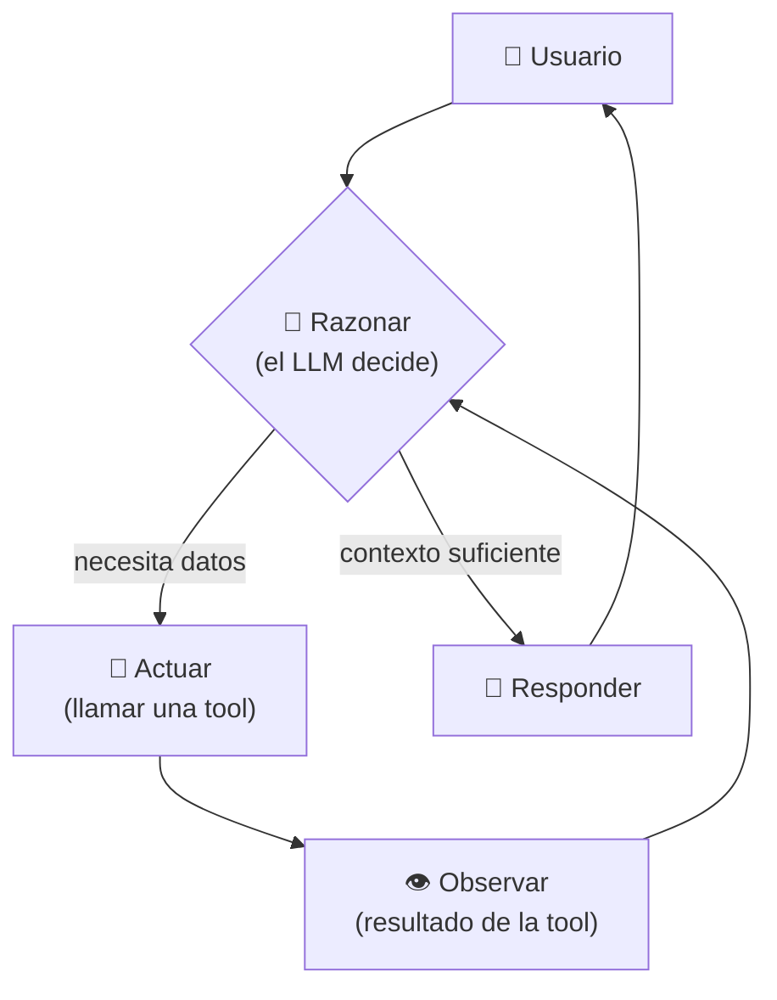
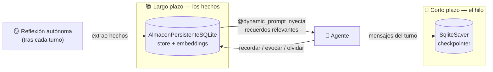
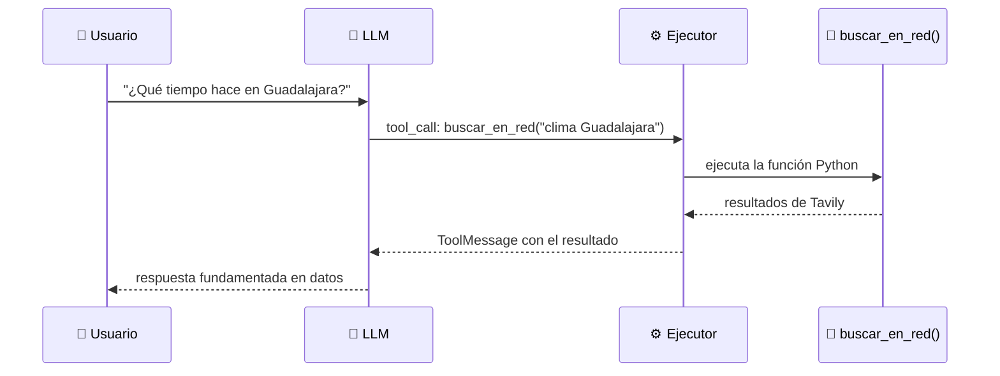
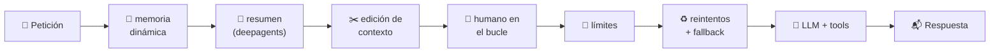
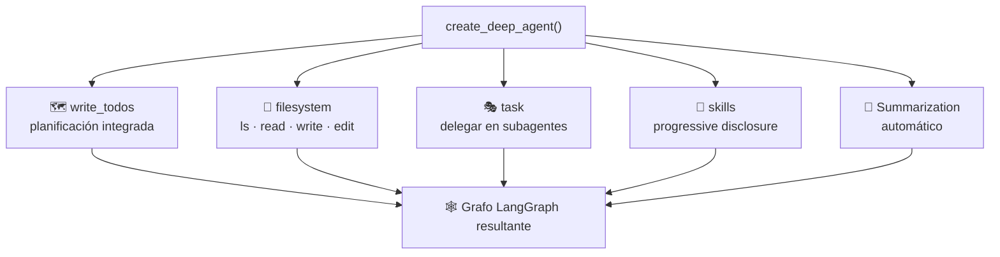
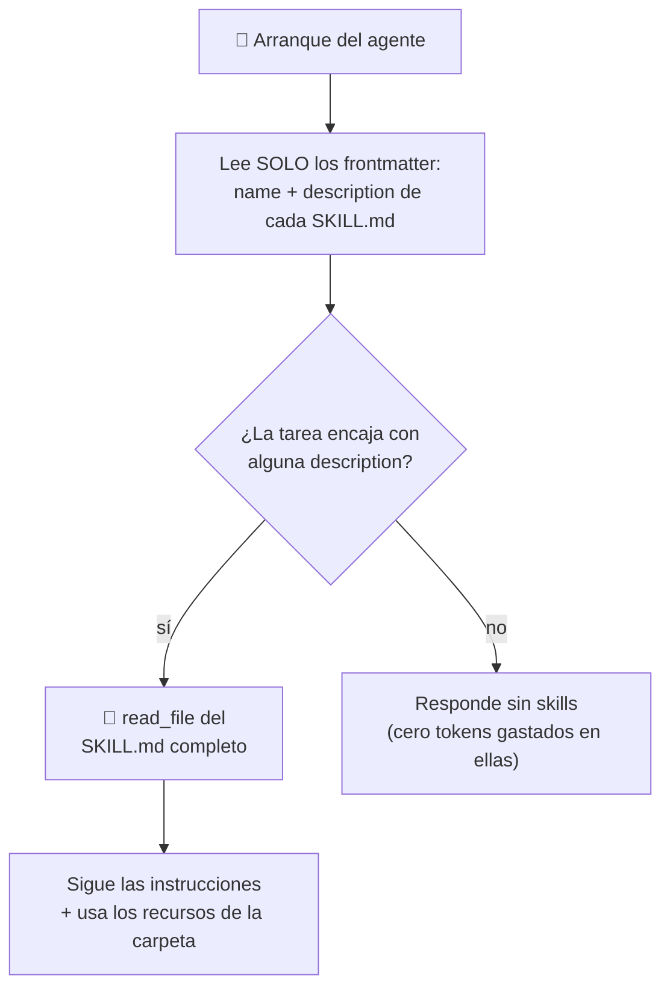
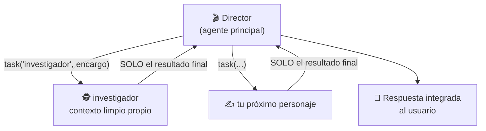
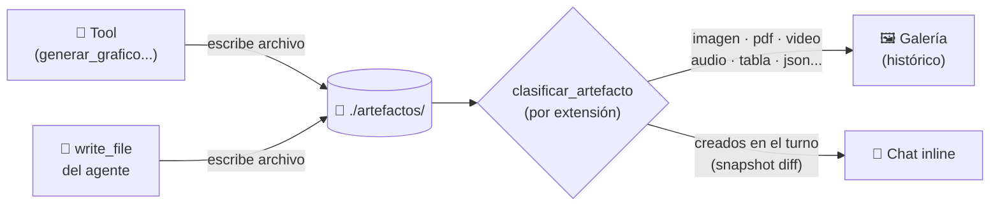
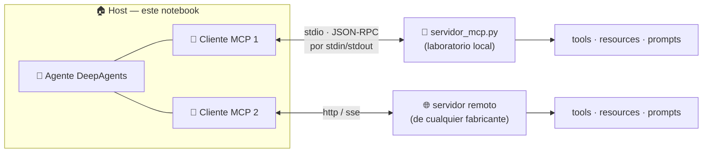
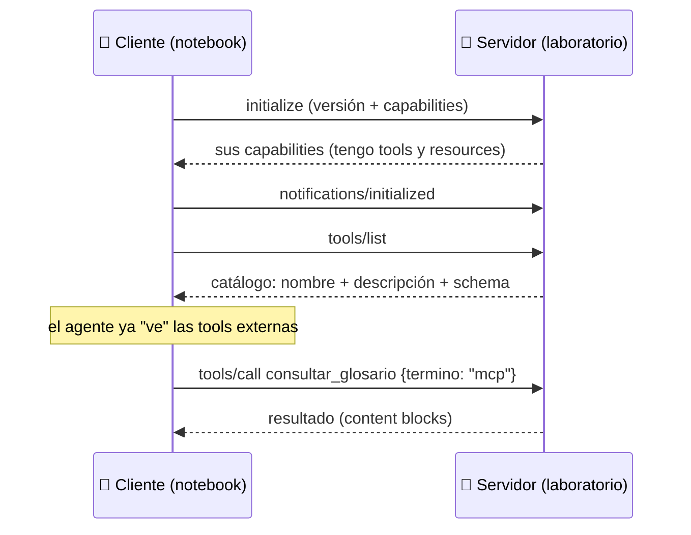

# MCP + Material Educativo Completo — Plan de Implementación

> **For agentic workers:** REQUIRED SUB-SKILL: Use superpowers:subagent-driven-development (recommended) or superpowers:executing-plans to implement this plan task-by-task. Steps use checkbox (`- [ ]`) syntax for tracking.

**Goal:** Integrar MCP (cliente vía langchain-mcp-adapters + servidor demo FastMCP propio + panel + radiografía JSON-RPC) en `agent_deep.py` como CONCEPTO 9, y añadir módulos educativos (teoría + diagrama mermaid) para los 9 conceptos.

**Architecture:** Lógica pura en `mcp_soporte.py` (stdlib, testeable sin red); servidor demo legible en `servidor_mcp.py`; el notebook solo hace UI + wiring. Tools MCP se descubren async por-servidor (fallo aislado), se suman a `herramientas_totales` y entran a `create_deep_agent` como cualquier tool. Recarga reactiva vía `mo.state` (patrón ya probado con skills/reparto). Chat migra a `ainvoke` (tools MCP son async-only).

**Tech Stack:** Python 3.11+, marimo, deepagents, langchain-mcp-adapters, mcp (FastMCP), pytest, uv.

**Spec:** `docs/superpowers/specs/2026-07-04-mcp-course-material-design.md`

## Global Constraints

- NO modificar `agent_full.py` ni `cerebro_en_el_frasco.py`.
- NO usar `git add -A` ni `git add .` JAMÁS. Añadir solo archivos explícitos por ruta.
- NO commitear: `pyproject.toml`, `uv.lock`, `sub_agentes.py`, `__marimo__/*`, `agent_full.py` (tienen cambios del usuario sin commitear). Si `uv add` los toca, se dejan sin stagear.
- Commits terminan con: `Co-Authored-By: Claude Fable 5 <noreply@anthropic.com>`
- Todo texto de cara al estudiante en español; comentarios educativos estilo del notebook existente.
- Reglas de celdas marimo: parámetros = nombres consumidos; return tuple = nombres expuestos; cada nombre global definido en exactamente UNA celda; `_x` = local de celda; `mo.state` para invalidación cruzada.
- DeepAgents: NO añadir `SummarizationMiddleware` ni `TodoListMiddleware` manuales (AssertionError por duplicado / conflicto con write_todos). El middleware de memoria APPENDEA al system_prompt, nunca lo reemplaza.
- `mcp_soporte.py`: imports solo stdlib (json, subprocess, pathlib) + `from deep_soporte import _nombre_seguro`. Sin marimo, sin langchain, sin yaml.
- Tests unitarios NO tocan red ni lanzan subprocesos. El único test que lanza subprocess es el de integración del servidor demo, con skipif.
- Comando de tests: `uv run --with pyyaml,pytest pytest tests/ -v`
- El notebook debe seguir pasando: `python -c "import ast; ast.parse(open('agent_deep.py', encoding='utf-8').read())"` y `uv run agent_deep.py` exit 0 con y sin `NVIDIA_API_KEY`.

## Estructura de archivos

| Archivo | Acción | Responsabilidad |
|---|---|---|
| `mcp_soporte.py` | Crear | Config CRUD + normalización + diálogo crudo stdio (pura, testeable) |
| `servidor_mcp.py` | Crear | Servidor MCP demo FastMCP (3 tools + 1 resource), legible por el estudiante |
| `mcp_config.json` | Crear (semilla) | Config declarativa estilo claude_desktop_config.json |
| `tests/test_mcp_soporte.py` | Crear | Tests unitarios + 1 integración con skipif |
| `agent_deep.py` | Modificar | CONCEPTO 9, celdas MCP, panel, radiografía, async chat, módulos educativos 1-9 |

---

### Task 1: `mcp_soporte.py` — Config CRUD y normalización (TDD)

**Files:**
- Create: `mcp_soporte.py`
- Test: `tests/test_mcp_soporte.py`

**Interfaces (Produces — tasks posteriores dependen de estas firmas exactas):**
- `cargar_config_mcp(ruta: Path) -> tuple[dict, list[str]]` — (servidores, avisos); nunca lanza.
- `guardar_config_mcp(ruta: Path, servidores: dict) -> None`
- `validar_servidor(cfg: dict) -> list[str]` — lista de errores, vacía si válido.
- `agregar_servidor(ruta: Path, nombre: str, cfg: dict) -> str` — "✅ ..." o lanza `ValueError`.
- `eliminar_servidor(ruta: Path, nombre: str) -> bool`
- `parsear_env(texto: str) -> dict` — líneas "CLAVE=valor" → dict.
- `normalizar_conexiones(servidores: dict, ejecutable: str, raiz: Path) -> dict` — filtra `enabled:false`, `"python"`→ejecutable, args relativos existentes→absolutos, quita clave `enabled`, default `transport:"stdio"`.
- `sembrar_config_mcp(ruta: Path) -> None` — idempotente.
- `SEMILLA_MCP: dict` — constante con el servidor `laboratorio`.
- (El diálogo crudo `dialogo_crudo_stdio` se añade en Task 2, mismo módulo.)

- [ ] **Step 1: Escribir tests que fallan**

Crear `tests/test_mcp_soporte.py`:

```python
"""Tests de mcp_soporte.py — config MCP pura, sin red ni subprocess."""

import json

import pytest

import mcp_soporte as ms


# ── cargar_config_mcp ────────────────────────────────────────────────────────


def test_cargar_config_inexistente_devuelve_vacio(tmp_path):
    servidores, avisos = ms.cargar_config_mcp(tmp_path / "no_existe.json")
    assert servidores == {}
    assert avisos == []


def test_cargar_config_corrupta_devuelve_aviso(tmp_path):
    ruta = tmp_path / "mcp_config.json"
    ruta.write_text("{esto no es json", encoding="utf-8")
    servidores, avisos = ms.cargar_config_mcp(ruta)
    assert servidores == {}
    assert len(avisos) == 1
    assert "ilegible" in avisos[0]


def test_cargar_config_mcpservers_no_dict_devuelve_aviso(tmp_path):
    ruta = tmp_path / "mcp_config.json"
    ruta.write_text(json.dumps({"mcpServers": [1, 2]}), encoding="utf-8")
    servidores, avisos = ms.cargar_config_mcp(ruta)
    assert servidores == {}
    assert len(avisos) == 1


# ── agregar / eliminar / roundtrip ───────────────────────────────────────────


def test_agregar_y_recargar_roundtrip(tmp_path):
    ruta = tmp_path / "mcp_config.json"
    msg = ms.agregar_servidor(
        ruta, "docs", {"transport": "http", "url": "http://localhost:3000/mcp"}
    )
    assert msg.startswith("✅")
    servidores, _ = ms.cargar_config_mcp(ruta)
    assert servidores["docs"]["url"] == "http://localhost:3000/mcp"


def test_agregar_nombre_inseguro_lanza_valueerror(tmp_path):
    with pytest.raises(ValueError):
        ms.agregar_servidor(
            tmp_path / "c.json", "../evil", {"transport": "stdio", "command": "x"}
        )


def test_agregar_config_invalida_lanza_valueerror(tmp_path):
    with pytest.raises(ValueError):
        ms.agregar_servidor(tmp_path / "c.json", "roto", {"transport": "stdio"})


def test_eliminar_servidor_existente_e_inexistente(tmp_path):
    ruta = tmp_path / "c.json"
    ms.agregar_servidor(ruta, "temporal", {"transport": "stdio", "command": "x"})
    assert ms.eliminar_servidor(ruta, "temporal") is True
    assert ms.eliminar_servidor(ruta, "temporal") is False


# ── validar_servidor ─────────────────────────────────────────────────────────


def test_validar_transporte_invalido():
    assert ms.validar_servidor({"transport": "palomas"}) != []


def test_validar_stdio_requiere_command():
    assert ms.validar_servidor({"transport": "stdio"}) != []
    assert ms.validar_servidor({"transport": "stdio", "command": "python"}) == []


def test_validar_http_requiere_url():
    assert ms.validar_servidor({"transport": "http"}) != []
    assert ms.validar_servidor({"transport": "http", "url": "http://x/mcp"}) == []


# ── parsear_env ──────────────────────────────────────────────────────────────


def test_parsear_env_basico_y_ruido():
    texto = "API_KEY=abc123\n# comentario\n\nsin_igual\nOTRA = con espacios "
    env = ms.parsear_env(texto)
    assert env == {"API_KEY": "abc123", "OTRA": "con espacios"}


def test_parsear_env_vacio():
    assert ms.parsear_env("") == {}
    assert ms.parsear_env(None) == {}


# ── normalizar_conexiones ────────────────────────────────────────────────────


def test_normalizar_filtra_deshabilitados_y_quita_enabled(tmp_path):
    servidores = {
        "on": {"transport": "stdio", "command": "x", "enabled": True},
        "off": {"transport": "stdio", "command": "y", "enabled": False},
    }
    conexiones = ms.normalizar_conexiones(servidores, "/venv/python", tmp_path)
    assert "off" not in conexiones
    assert "enabled" not in conexiones["on"]


def test_normalizar_python_usa_ejecutable_del_venv(tmp_path):
    servidores = {"lab": {"transport": "stdio", "command": "python", "args": []}}
    conexiones = ms.normalizar_conexiones(servidores, "/venv/bin/python", tmp_path)
    assert conexiones["lab"]["command"] == "/venv/bin/python"


def test_normalizar_resuelve_args_relativos_existentes(tmp_path):
    (tmp_path / "servidor_mcp.py").write_text("# demo", encoding="utf-8")
    servidores = {
        "lab": {
            "transport": "stdio",
            "command": "python",
            "args": ["servidor_mcp.py", "--flag"],
        }
    }
    conexiones = ms.normalizar_conexiones(servidores, "py", tmp_path)
    assert conexiones["lab"]["args"][0] == str(
        (tmp_path / "servidor_mcp.py").resolve()
    )
    assert conexiones["lab"]["args"][1] == "--flag"  # no-archivo queda igual


def test_normalizar_default_transport_stdio(tmp_path):
    conexiones = ms.normalizar_conexiones(
        {"lab": {"command": "x"}}, "py", tmp_path
    )
    assert conexiones["lab"]["transport"] == "stdio"


# ── sembrar ──────────────────────────────────────────────────────────────────


def test_sembrar_config_idempotente(tmp_path):
    ruta = tmp_path / "mcp_config.json"
    ms.sembrar_config_mcp(ruta)
    servidores, _ = ms.cargar_config_mcp(ruta)
    assert "laboratorio" in servidores
    ms.agregar_servidor(ruta, "extra", {"transport": "stdio", "command": "x"})
    ms.sembrar_config_mcp(ruta)  # segunda llamada NO pisa
    servidores2, _ = ms.cargar_config_mcp(ruta)
    assert "extra" in servidores2
```

- [ ] **Step 2: Verificar que fallan**

Run: `uv run --with pyyaml,pytest pytest tests/test_mcp_soporte.py -v`
Expected: FAIL/ERROR con `ModuleNotFoundError: No module named 'mcp_soporte'` (el conftest.py existente ya añade la raíz al sys.path).

- [ ] **Step 3: Implementar `mcp_soporte.py`**

```python
# ═══════════════════════════════════════════════════════════════════════════════════════
#  MCP_SOPORTE · Lógica pura para la integración MCP del Agente Profundo
# ═══════════════════════════════════════════════════════════════════════════════════════
#
#  Este módulo NO importa marimo ni langchain: solo stdlib. Así todo se prueba
#  con pytest sin levantar el notebook ni tocar la red.
#
#  El archivo mcp_config.json usa el MISMO formato que claude_desktop_config.json
#  (el estándar de facto del ecosistema MCP): {"mcpServers": {nombre: {...}}}.

from __future__ import annotations

import json
import subprocess
from pathlib import Path

from deep_soporte import _nombre_seguro

TRANSPORTES_VALIDOS = {"stdio", "http", "sse"}

SEMILLA_MCP = {
    "laboratorio": {
        "transport": "stdio",
        "command": "python",
        "args": ["servidor_mcp.py"],
        "enabled": True,
    }
}


def cargar_config_mcp(ruta: Path) -> tuple[dict, list[str]]:
    """Lee mcp_config.json → (servidores, avisos). Nunca lanza excepción."""
    ruta = Path(ruta)
    if not ruta.exists():
        return {}, []
    try:
        datos = json.loads(ruta.read_text(encoding="utf-8"))
    except (OSError, json.JSONDecodeError) as e:
        return {}, [f"⚠️ mcp_config.json ilegible: {e}"]
    servidores = datos.get("mcpServers", {})
    if not isinstance(servidores, dict):
        return {}, ["⚠️ 'mcpServers' debe ser un objeto JSON {nombre: config}"]
    return servidores, []


def guardar_config_mcp(ruta: Path, servidores: dict) -> None:
    """Escribe el dict de servidores con el envoltorio {"mcpServers": ...}."""
    Path(ruta).write_text(
        json.dumps({"mcpServers": servidores}, indent=2, ensure_ascii=False)
        + "\n",
        encoding="utf-8",
    )


def validar_servidor(cfg: dict) -> list[str]:
    """Devuelve la lista de errores de una config de servidor (vacía = válida)."""
    errores = []
    transporte = cfg.get("transport", "stdio")
    if transporte not in TRANSPORTES_VALIDOS:
        errores.append(f"transporte inválido: {transporte!r} (usa stdio/http/sse)")
    if transporte == "stdio" and not cfg.get("command"):
        errores.append("el transporte stdio requiere 'command'")
    if transporte in ("http", "sse") and not cfg.get("url"):
        errores.append(f"el transporte {transporte} requiere 'url'")
    return errores


def agregar_servidor(ruta: Path, nombre: str, cfg: dict) -> str:
    """Valida y persiste un servidor. Lanza ValueError si nombre/config inválidos."""
    nombre = _nombre_seguro(nombre)
    errores = validar_servidor(cfg)
    if errores:
        raise ValueError("; ".join(errores))
    servidores, _ = cargar_config_mcp(ruta)
    servidores[nombre] = cfg
    guardar_config_mcp(ruta, servidores)
    return f"✅ Servidor '{nombre}' guardado en {Path(ruta).name}"


def eliminar_servidor(ruta: Path, nombre: str) -> bool:
    """Elimina un servidor del JSON. True si existía."""
    nombre = _nombre_seguro(nombre)
    servidores, _ = cargar_config_mcp(ruta)
    if nombre not in servidores:
        return False
    del servidores[nombre]
    guardar_config_mcp(ruta, servidores)
    return True


def parsear_env(texto: str) -> dict:
    """Convierte líneas 'CLAVE=valor' en dict. Ignora comentarios y ruido."""
    env = {}
    for linea in (texto or "").splitlines():
        linea = linea.strip()
        if not linea or linea.startswith("#") or "=" not in linea:
            continue
        clave, _, valor = linea.partition("=")
        clave = clave.strip()
        if clave:
            env[clave] = valor.strip()
    return env


def normalizar_conexiones(servidores: dict, ejecutable: str, raiz: Path) -> dict:
    """Del JSON crudo al formato que espera MultiServerMCPClient.

    - Filtra servidores con "enabled": false (deshabilitar sin borrar).
    - "command": "python" → el Python del venv actual (sys.executable del
      notebook): evita que el subprocess use otro intérprete sin las deps.
    - Args relativos que apuntan a archivos existentes bajo `raiz` → absolutos
      (el cwd del subprocess no está garantizado).
    - Quita la clave 'enabled' (no es parte del contrato del cliente).
    """
    conexiones = {}
    raiz = Path(raiz)
    for nombre, cfg in servidores.items():
        if not isinstance(cfg, dict) or cfg.get("enabled", True) is False:
            continue
        limpio = {k: v for k, v in cfg.items() if k != "enabled"}
        limpio.setdefault("transport", "stdio")
        if limpio.get("command") == "python":
            limpio["command"] = ejecutable
        args = limpio.get("args")
        if isinstance(args, list):
            limpio["args"] = [
                str((raiz / a).resolve())
                if isinstance(a, str)
                and not Path(a).is_absolute()
                and (raiz / a).is_file()
                else a
                for a in args
            ]
        conexiones[nombre] = limpio
    return conexiones


def sembrar_config_mcp(ruta: Path) -> None:
    """Crea mcp_config.json con el servidor demo si no existe (idempotente)."""
    ruta = Path(ruta)
    if not ruta.exists():
        guardar_config_mcp(ruta, dict(SEMILLA_MCP))
```

- [ ] **Step 4: Verificar que pasan**

Run: `uv run --with pyyaml,pytest pytest tests/test_mcp_soporte.py -v`
Expected: 17 passed. Después la suite completa: `uv run --with pyyaml,pytest pytest tests/ -v` → 44 passed (27 previos + 17 nuevos).

- [ ] **Step 5: Commit**

```bash
git add mcp_soporte.py tests/test_mcp_soporte.py
git commit -m "feat: mcp_soporte con config CRUD y normalizacion de conexiones

Co-Authored-By: Claude Fable 5 <noreply@anthropic.com>"
```

---

### Task 2: `servidor_mcp.py` + diálogo crudo stdio + test de integración

**Files:**
- Create: `servidor_mcp.py`
- Create: `mcp_config.json` (semilla commiteada, portable — args relativos)
- Modify: `mcp_soporte.py` (añadir `dialogo_crudo_stdio` al final)
- Test: `tests/test_mcp_soporte.py` (añadir 1 test de integración)

**Interfaces:**
- Consumes: nada de Task 1 (módulo independiente).
- Produces: `dialogo_crudo_stdio(comando: list[str], peticiones: list[dict], timeout: float = 20.0) -> list[dict]` — devuelve solo mensajes con "id" (respuestas), en orden. Lanza `TimeoutError` si el servidor no responde. `servidor_mcp.py` ejecutable con `python servidor_mcp.py` (stdio). Tools del demo: `consultar_glosario`, `estadisticas_curso`, `convertir_unidades`.

- [ ] **Step 1: Test de integración (skipif) + test unitario del parser**

Añadir al final de `tests/test_mcp_soporte.py`:

```python
# ── dialogo_crudo_stdio + servidor demo (integración) ────────────────────────


def test_integracion_servidor_demo_lista_tools():
    """Lanza servidor_mcp.py real y verifica el catálogo vía JSON-RPC crudo.

    Se salta si el SDK mcp no está instalado en el entorno de test.
    """
    pytest.importorskip("mcp")
    import sys
    from pathlib import Path

    servidor = Path(__file__).parent.parent / "servidor_mcp.py"
    assert servidor.exists()

    peticiones = [
        {
            "jsonrpc": "2.0",
            "id": 1,
            "method": "initialize",
            "params": {
                "protocolVersion": "2025-03-26",
                "capabilities": {},
                "clientInfo": {"name": "test-radiografia", "version": "1.0"},
            },
        },
        {"jsonrpc": "2.0", "method": "notifications/initialized"},
        {"jsonrpc": "2.0", "id": 2, "method": "tools/list"},
    ]
    respuestas = ms.dialogo_crudo_stdio(
        [sys.executable, str(servidor)], peticiones, timeout=30.0
    )
    assert len(respuestas) == 2  # initialize + tools/list (la notificación no responde)
    catalogo = respuestas[1]["result"]["tools"]
    nombres = {t["name"] for t in catalogo}
    assert nombres == {
        "consultar_glosario",
        "estadisticas_curso",
        "convertir_unidades",
    }
```

Nota para el implementador: este test lanza un subprocess real (~2-5 s). Es la única excepción permitida a "tests sin subprocess" (Global Constraints) porque valida el contrato servidor↔protocolo de punta a punta.

- [ ] **Step 2: Verificar que falla**

Run: `uv run --with pyyaml,pytest,mcp pytest tests/test_mcp_soporte.py::test_integracion_servidor_demo_lista_tools -v`
Expected: FAIL — `AttributeError: module 'mcp_soporte' has no attribute 'dialogo_crudo_stdio'` (o AssertionError por servidor inexistente).

- [ ] **Step 3: Implementar `dialogo_crudo_stdio` (final de `mcp_soporte.py`)**

```python
def dialogo_crudo_stdio(
    comando: list[str], peticiones: list[dict], timeout: float = 20.0
) -> list[dict]:
    """Habla JSON-RPC CRUDO con un servidor MCP stdio y devuelve sus respuestas.

    ⚠️ SOLO EDUCATIVO — la celda "radiografía" lo usa para enseñar el cable del
    protocolo (un mensaje JSON por línea sobre stdin/stdout). En producción el
    agente usa langchain-mcp-adapters, que gestiona sesiones, reintentos y
    versiones por nosotros.

    Envía todas las peticiones de golpe (el servidor las procesa en orden),
    cierra stdin y recolecta las respuestas. Las notificaciones (mensajes sin
    "id") no generan respuesta — por eso el resultado puede ser más corto que
    la entrada.
    """
    entrada = "".join(json.dumps(p) + "\n" for p in peticiones)
    proc = subprocess.Popen(
        comando,
        stdin=subprocess.PIPE,
        stdout=subprocess.PIPE,
        stderr=subprocess.DEVNULL,
        text=True,
        encoding="utf-8",
    )
    try:
        salida, _ = proc.communicate(input=entrada, timeout=timeout)
    except subprocess.TimeoutExpired:
        proc.kill()
        raise TimeoutError(
            f"El servidor MCP no respondió en {timeout}s: {comando}"
        ) from None
    respuestas = []
    for linea in salida.splitlines():
        try:
            msg = json.loads(linea)
        except json.JSONDecodeError:
            continue
        if isinstance(msg, dict) and "id" in msg:
            respuestas.append(msg)
    return respuestas
```

- [ ] **Step 4: Implementar `servidor_mcp.py`**

```python
# ═══════════════════════════════════════════════════════════════════════════════════════
#  SERVIDOR_MCP · El "periférico" que enchufamos al Agente Profundo
# ═══════════════════════════════════════════════════════════════════════════════════════
#
#  Este archivo ES un servidor MCP completo. Léelo entero: son ~70 líneas.
#
#  · FastMCP (del SDK oficial `mcp`) convierte funciones Python en tools MCP,
#    igual que @tool de LangChain — pero aquí las tools viven en OTRO PROCESO
#    y se anuncian por un protocolo estándar (JSON-RPC sobre stdio).
#  · Cualquier cliente MCP (este notebook, Claude Code, Cursor...) puede
#    conectarse a este mismo archivo sin cambiar ni una línea.
#  · Ejercicio: añade tu propia @mcp.tool() abajo, pulsa "Recargar" en el
#    Panel MCP del notebook, y observa cómo el agente la descubre.
#
#  Ejecutar a mano (lo normal es que lo lance el notebook):
#      python servidor_mcp.py

from pathlib import Path

from mcp.server.fastmcp import FastMCP

RAIZ = Path(__file__).parent.resolve()

mcp = FastMCP("laboratorio-curso")

GLOSARIO = {
    "agente": "Programa que combina un LLM con tools en un ciclo ReAct: razonar, actuar, observar, repetir.",
    "tool": "Función Python que el LLM puede invocar; su docstring y type hints son el contrato.",
    "middleware": "Capa que envuelve al agente e intercepta petición/respuesta (límites, reintentos, PII...).",
    "skill": "Carpeta con SKILL.md (estándar agentskills.io) que el agente lee bajo demanda.",
    "subagente": "Personaje con contexto propio al que el director delega vía la tool task.",
    "mcp": "Model Context Protocol: el 'puerto USB-C' que conecta agentes con servidores de tools externos.",
    "checkpointer": "Persistencia del hilo de conversación turno a turno (memoria de corto plazo).",
    "store": "Base de hechos duraderos del usuario, compartida entre sesiones (memoria de largo plazo).",
}


@mcp.tool()
def consultar_glosario(termino: str) -> str:
    """Devuelve la definición de un término del curso de agentes de IA.

    Términos disponibles: agente, tool, middleware, skill, subagente, mcp,
    checkpointer, store.
    """
    clave = termino.lower().strip()
    if clave in GLOSARIO:
        return f"📖 {clave}: {GLOSARIO[clave]}"
    disponibles = ", ".join(sorted(GLOSARIO))
    return f"No tengo '{termino}'. Prueba con: {disponibles}"


@mcp.tool()
def estadisticas_curso() -> str:
    """Cuenta las skills, subagentes y artefactos instalados en este proyecto."""
    n_skills = len(list((RAIZ / "skills").glob("*/SKILL.md")))
    n_subagentes = len(list((RAIZ / "subagentes").glob("*.md")))
    n_artefactos = sum(1 for p in (RAIZ / "artefactos").rglob("*") if p.is_file())
    return (
        f"📊 Proyecto del curso: {n_skills} skills, "
        f"{n_subagentes} subagentes, {n_artefactos} artefactos."
    )


@mcp.tool()
def convertir_unidades(valor: float, de: str, a: str) -> str:
    """Convierte unidades comunes: km↔mi, kg↔lb, c↔f (Celsius/Fahrenheit)."""
    par = (de.lower().strip(), a.lower().strip())
    lineales = {
        ("km", "mi"): 0.621371,
        ("mi", "km"): 1.609344,
        ("kg", "lb"): 2.204623,
        ("lb", "kg"): 0.453592,
    }
    if par in lineales:
        return f"{valor} {par[0]} = {valor * lineales[par]:.4f} {par[1]}"
    if par == ("c", "f"):
        return f"{valor} °C = {valor * 9 / 5 + 32:.2f} °F"
    if par == ("f", "c"):
        return f"{valor} °F = {(valor - 32) * 5 / 9:.2f} °C"
    return f"No sé convertir de '{de}' a '{a}'. Pares: km/mi, kg/lb, c/f."


@mcp.resource("curso://glosario")
def glosario_completo() -> str:
    """Glosario completo del curso en markdown (ejemplo de RESOURCE MCP:
    contenido de solo lectura que un cliente puede pedir, distinto de una tool)."""
    return "\n".join(f"- **{k}**: {v}" for k, v in sorted(GLOSARIO.items()))


if __name__ == "__main__":
    # Sin argumentos = transporte stdio: el proceso lee JSON-RPC por stdin
    # y responde por stdout. Por eso NUNCA se imprime nada a stdout aquí.
    mcp.run()
```

- [ ] **Step 5: Crear `mcp_config.json` (semilla portable, args relativos)**

```json
{
  "mcpServers": {
    "laboratorio": {
      "transport": "stdio",
      "command": "python",
      "args": ["servidor_mcp.py"],
      "enabled": true
    }
  }
}
```

- [ ] **Step 6: Verificar**

Run: `uv run --with pyyaml,pytest,mcp pytest tests/test_mcp_soporte.py -v`
Expected: 18 passed (17 de Task 1 + integración). Si `mcp` faltara en el entorno: 17 passed, 1 skipped.

- [ ] **Step 7: Commit**

```bash
git add servidor_mcp.py mcp_config.json mcp_soporte.py tests/test_mcp_soporte.py
git commit -m "feat: servidor MCP demo FastMCP y dialogo JSON-RPC crudo educativo

Co-Authored-By: Claude Fable 5 <noreply@anthropic.com>"
```

---

### Task 3: Wiring MCP en `agent_deep.py` + migración async del chat

**Files:**
- Modify: `agent_deep.py` — header uv, celda de imports (~213-307), celda de dirs (~310-364), nueva celda mo.state, nueva celda descubrimiento, celda del agente (~1268-1314), celda `ejecutar_agente` (~1398-1639)

**Interfaces:**
- Consumes: `mcp_soporte` completo (Task 1-2), `servidor_mcp.py`, `mcp_config.json`.
- Produces (para Tasks 4-5): nombres globales de celda `tools_mcp: list`, `estado_mcp: dict[str, dict]` (claves `estado`/`tools`/`detalle`), `avisos_mcp: list[str]`, `RUTA_CONFIG_MCP: Path`, `obtener_version_mcp`/`marcar_version_mcp` (mo.state), flag `ADAPTERS_MCP: bool`, y `ms` (módulo) + `sys` + `asyncio` exportados desde la celda de imports.

- [ ] **Step 1: Instalar dependencia en el entorno del proyecto (sin commitearla)**

Run: `uv add langchain-mcp-adapters`
Después verificar: `git status --short pyproject.toml uv.lock` — quedarán Modified; **NO stagearlos** (contienen cambios del usuario; Global Constraints).

- [ ] **Step 2: Header uv del notebook**

En el bloque `# /// script` (líneas 1-33), añadir tras `"pyyaml>=6",`:

```python
#     "langchain-mcp-adapters>=0.1",
```

(`mcp>=1` y `marimo[mcp]` ya están en el header — no duplicar.)

- [ ] **Step 3: Celda de imports**

En la celda `@app.cell` de imports (línea ~213), añadir tras `import xml.etree.ElementTree as ET`:

```python
    import asyncio
```

Tras el bloque `import deep_soporte as ds`:

```python
    import mcp_soporte as ms

    # ── Cliente MCP (opcional): si falta el paquete, el agente sigue sin MCP ────────
    try:
        from langchain_mcp_adapters.client import MultiServerMCPClient

        ADAPTERS_MCP = True
    except ImportError:
        ADAPTERS_MCP = False
        MultiServerMCPClient = None
```

Y en el tuple de return añadir (orden alfabético como está): `ADAPTERS_MCP`, `MultiServerMCPClient`, `asyncio`, `ms`, `sys` (¡`sys` ya se importa en la celda pero NO está en el return — hay que reañadirlo!).

- [ ] **Step 4: Celda de dirs (línea ~310)**

Tras `ds.sembrar_subagente_ejemplo(DIR_SUBAGENTES)`:

```python
    # Config MCP declarativa (mismo formato que claude_desktop_config.json)
    RUTA_CONFIG_MCP = RAIZ_PROYECTO / "mcp_config.json"
    ms.sembrar_config_mcp(RUTA_CONFIG_MCP)
```

Añadir `ms` a los parámetros de la celda y `RUTA_CONFIG_MCP` al return.

- [ ] **Step 5: Nueva celda mo.state (después de la celda de version_skills, ~línea 1707)**

```python
@app.cell
def _(mo):
    obtener_version_mcp, marcar_version_mcp = mo.state(0)
    return marcar_version_mcp, obtener_version_mcp
```

- [ ] **Step 6: Nueva celda de descubrimiento MCP (async — insertar ANTES de la celda del agente)**

```python
@app.cell
async def _(
    ADAPTERS_MCP,
    MultiServerMCPClient,
    RAIZ_PROYECTO,
    RUTA_CONFIG_MCP,
    asyncio,
    ms,
    obtener_version_mcp,
    sys,
):
    # Dependencia reactiva: "Recargar" en el Panel MCP relanza esta celda
    _ = obtener_version_mcp()

    _servidores, avisos_mcp = ms.cargar_config_mcp(RUTA_CONFIG_MCP)
    _conexiones = ms.normalizar_conexiones(_servidores, sys.executable, RAIZ_PROYECTO)

    tools_mcp = []
    estado_mcp = {}

    for _nombre in _servidores:
        if _nombre not in _conexiones:
            estado_mcp[_nombre] = {
                "estado": "⚪ deshabilitado",
                "tools": [],
                "detalle": "enabled: false en mcp_config.json",
            }

    if _conexiones and not ADAPTERS_MCP:
        avisos_mcp.append(
            "⚠️ langchain-mcp-adapters no está instalado — servidores MCP ignorados."
        )
    elif _conexiones:
        # Un cliente POR SERVIDOR: si uno falla (comando roto, red caída),
        # los demás siguen funcionando y el error queda visible en el panel.
        for _nombre, _conexion in _conexiones.items():
            try:
                _cliente = MultiServerMCPClient(
                    {_nombre: _conexion}, tool_name_prefix=True
                )
                _tools = await asyncio.wait_for(
                    _cliente.get_tools(), timeout=15
                )
                tools_mcp.extend(_tools)
                estado_mcp[_nombre] = {
                    "estado": f"🟢 {len(_tools)} tools",
                    "tools": [_t.name for _t in _tools],
                    "detalle": "",
                }
            except Exception as _e:
                estado_mcp[_nombre] = {
                    "estado": "🔴 error",
                    "tools": [],
                    "detalle": f"{type(_e).__name__}: {_e}"[:300],
                }
    return avisos_mcp, estado_mcp, tools_mcp
```

Nota educativa a incluir como comentario en la celda: `tool_name_prefix=True` renombra cada tool a `<servidor>_<tool>` (ej. `laboratorio_consultar_glosario`) para evitar colisiones entre servidores.

- [ ] **Step 7: Celda del agente (~línea 1268)**

Añadir `tools_mcp` a los parámetros de la celda y cambiar:

```python
            tools=herramientas_totales,
```

por:

```python
            tools=herramientas_totales + tools_mcp,
```

(Los subagentes siguen usando solo tools nativas de `registro_tools` — decisión deliberada: mantiene el grafo de dependencias de celdas simple. Documentado en la teoría del CONCEPTO 9.)

- [ ] **Step 8: Migrar `ejecutar_agente` a async**

En la celda ~1398, cambiar la firma y la invocación (el resto de la función — snapshot de artefactos, `_vista`, yields, reflexión — queda EXACTAMENTE igual; no cambiar el contenido de los yields):

```python
    async def ejecutar_agente(mensajes, config=None):
        """Función generadora async que mo.ui.chat llama en cada turno.

        ⚠️ Async porque las tools MCP de langchain-mcp-adapters son
        StructuredTool(coroutine=...) — solo invocables por la vía async.
        Con .invoke() sync, la primera tool MCP lanzaría NotImplementedError.
        marimo soporta generadores async en mo.ui.chat de forma nativa.
        """
```

y:

```python
            salida = await agente_cerebro.ainvoke(
                {"messages": [{"role": "user", "content": texto_usuario}]},
                cfg,
            )
```

(`_ejecutar_reflexion_autonoma` sigue siendo sync y se llama igual — bloquea el event loop unos segundos durante la reflexión; aceptable en un notebook educativo y documentado con un comentario de una línea.)

- [ ] **Step 9: Verificación headless**

```bash
python -c "import ast; ast.parse(open('agent_deep.py', encoding='utf-8').read())"
uv run agent_deep.py
```
Expected: exit 0 en ambos. Segunda corrida sin API key: `$env:NVIDIA_API_KEY=""; uv run agent_deep.py` → exit 0. La celda de descubrimiento DEBE conectar al servidor laboratorio (verificar que no aparece traza de error; opcional: añadir `print` temporal NO — comprobar vía test de integración ya existente).

- [ ] **Step 10: Commit**

```bash
git add agent_deep.py
git commit -m "feat: descubrimiento de tools MCP y chat async en agent_deep

Co-Authored-By: Claude Fable 5 <noreply@anthropic.com>"
```

---

### Task 4: Panel MCP (tabla de estado + formulario + eliminar + recargar)

**Files:**
- Modify: `agent_deep.py` — insertar 3 celdas nuevas después del bloque del Panel de Skills (~línea 1774) y añadir fila MCP al dashboard (~línea 2218)

**Interfaces:**
- Consumes: `estado_mcp`, `avisos_mcp`, `tools_mcp`, `RUTA_CONFIG_MCP`, `ms`, `marcar_version_mcp`/`obtener_version_mcp` (Task 3).
- Produces: elementos UI `ui_mcp_*` (solo consumidos por la celda lógica del propio panel).

- [ ] **Step 1: Celda markdown de sección**

```python
@app.cell(hide_code=True)
def _(mo):
    mo.md(r"""
    ---
    ## 🔌 Panel MCP — Servidores de Herramientas Externas

    MCP (*Model Context Protocol*) es el **puerto USB-C de los agentes**: cualquier
    servidor compatible enchufa sus tools al agente sin tocar el código del notebook.
    La configuración vive en `./mcp_config.json` — el mismo formato que
    `claude_desktop_config.json`, así que lo que aprendas aquí sirve para Claude
    Desktop, Claude Code, Cursor y el resto del ecosistema.

    > ⏳ *La primera conexión a un servidor `npx`/`uvx` puede tardar (descarga el
    > paquete). El descubrimiento tiene un timeout de 15 s por servidor.*
    """)
    return
```

- [ ] **Step 2: Celda de widgets**

```python
@app.cell
def _(mo):
    ui_mcp_nombre = mo.ui.text(label="**Nombre**", placeholder="filesystem")
    ui_mcp_transporte = mo.ui.dropdown(
        options=["stdio", "http", "sse"], value="stdio", label="**Transporte**"
    )
    ui_mcp_comando = mo.ui.text(
        label="**Comando** (stdio)", placeholder="npx · uvx · python"
    )
    ui_mcp_args = mo.ui.text_area(
        label="**Argumentos** (stdio) — uno por línea",
        placeholder="-y\n@modelcontextprotocol/server-filesystem\nD:/ruta/permitida",
        rows=3,
    )
    ui_mcp_url = mo.ui.text(
        label="**URL** (http/sse)", placeholder="http://localhost:8000/mcp"
    )
    ui_mcp_env = mo.ui.text_area(
        label="**Variables de entorno** — CLAVE=valor por línea (opcional)",
        placeholder="API_KEY=abc123",
        rows=2,
    )
    ui_boton_guardar_mcp = mo.ui.run_button(label="💾 Guardar servidor")
    ui_mcp_eliminar = mo.ui.text(
        label="**Eliminar servidor** (nombre)", placeholder="filesystem"
    )
    ui_boton_eliminar_mcp = mo.ui.run_button(label="🗑️ Eliminar")
    ui_boton_recargar_mcp = mo.ui.run_button(label="🔄 Recargar servidores")
    return (
        ui_boton_eliminar_mcp,
        ui_boton_guardar_mcp,
        ui_boton_recargar_mcp,
        ui_mcp_args,
        ui_mcp_comando,
        ui_mcp_eliminar,
        ui_mcp_env,
        ui_mcp_nombre,
        ui_mcp_transporte,
        ui_mcp_url,
    )
```

- [ ] **Step 3: Celda lógica + render del panel**

```python
@app.cell(hide_code=True)
def _(
    RUTA_CONFIG_MCP,
    avisos_mcp,
    estado_mcp,
    marcar_version_mcp,
    mo,
    ms,
    obtener_version_mcp,
    ui_boton_eliminar_mcp,
    ui_boton_guardar_mcp,
    ui_boton_recargar_mcp,
    ui_mcp_args,
    ui_mcp_comando,
    ui_mcp_eliminar,
    ui_mcp_env,
    ui_mcp_nombre,
    ui_mcp_transporte,
    ui_mcp_url,
):
    if ui_boton_recargar_mcp.value:
        marcar_version_mcp(obtener_version_mcp() + 1)

    _msg_mcp = ""
    if ui_boton_guardar_mcp.value and ui_mcp_nombre.value.strip():
        _cfg = {"transport": ui_mcp_transporte.value, "enabled": True}
        if ui_mcp_transporte.value == "stdio":
            _cfg["command"] = ui_mcp_comando.value.strip()
            _cfg["args"] = [
                _l.strip()
                for _l in ui_mcp_args.value.splitlines()
                if _l.strip()
            ]
        else:
            _cfg["url"] = ui_mcp_url.value.strip()
        _env = ms.parsear_env(ui_mcp_env.value)
        if _env:
            _cfg["env"] = _env
        try:
            _msg_mcp = ms.agregar_servidor(
                RUTA_CONFIG_MCP, ui_mcp_nombre.value.strip(), _cfg
            )
            marcar_version_mcp(obtener_version_mcp() + 1)
        except ValueError as _e:
            _msg_mcp = f"❌ {_e}"

    if ui_boton_eliminar_mcp.value and ui_mcp_eliminar.value.strip():
        try:
            if ms.eliminar_servidor(
                RUTA_CONFIG_MCP, ui_mcp_eliminar.value.strip()
            ):
                marcar_version_mcp(obtener_version_mcp() + 1)
                _msg_mcp = f"🗑️ Servidor '{ui_mcp_eliminar.value}' eliminado."
            else:
                _msg_mcp = f"❌ No existe '{ui_mcp_eliminar.value}'."
        except ValueError as _e:
            _msg_mcp = f"❌ {_e}"

    _formulario = mo.vstack(
        [
            mo.hstack([ui_mcp_nombre, ui_mcp_transporte], widths=[2, 1]),
            mo.hstack([ui_mcp_comando, ui_mcp_url], widths=[1, 1]),
            ui_mcp_args,
            ui_mcp_env,
            mo.hstack(
                [
                    ui_boton_guardar_mcp,
                    ui_mcp_eliminar,
                    ui_boton_eliminar_mcp,
                    ui_boton_recargar_mcp,
                ],
                widths=[1, 2, 1, 1],
            ),
        ]
    )

    _bloques = [_formulario]
    if _msg_mcp:
        _bloques.append(
            mo.callout(
                mo.md(_msg_mcp),
                kind="danger" if _msg_mcp.startswith("❌") else "success",
            )
        )
    for _aviso in avisos_mcp:
        _bloques.append(mo.callout(mo.md(_aviso), kind="warn"))

    if estado_mcp:
        _bloques.append(
            mo.ui.table(
                [
                    {
                        "Servidor": _n,
                        "Estado": _e["estado"],
                        "Tools descubiertas": ", ".join(_e["tools"]) or "—",
                        "Detalle": _e["detalle"] or "—",
                    }
                    for _n, _e in estado_mcp.items()
                ],
                selection=None,
            )
        )
    else:
        _bloques.append(
            mo.callout(
                mo.md("*(Sin servidores MCP — añade uno arriba)*"), kind="info"
            )
        )

    mo.vstack(_bloques)
    return
```

- [ ] **Step 4: Fila MCP en el dashboard**

En la celda del dashboard (~línea 2145), añadir `estado_mcp` y `tools_mcp` a los parámetros y en la tabla "🎭 Reparto y Recursos DeepAgents" añadir la fila:

```python
    | **Servidores MCP** | **{len(estado_mcp)}** configurados · **{len(tools_mcp)}** tools externas activas |
```

- [ ] **Step 5: Verificar y commit**

```bash
python -c "import ast; ast.parse(open('agent_deep.py', encoding='utf-8').read())"
uv run agent_deep.py
```
Expected: exit 0.

```bash
git add agent_deep.py
git commit -m "feat: panel MCP con formulario, tabla de estado y recarga reactiva

Co-Authored-By: Claude Fable 5 <noreply@anthropic.com>"
```

---

### Task 5: Celda "Radiografía del protocolo"

**Files:**
- Modify: `agent_deep.py` — 2 celdas nuevas justo después del Panel MCP (Task 4)

**Interfaces:**
- Consumes: `ms.dialogo_crudo_stdio` (Task 2), `RAIZ_PROYECTO`, `sys`, `json`, `mo`.

- [ ] **Step 1: Celda markdown + botón**

```python
@app.cell(hide_code=True)
def _(mo):
    ui_boton_radiografia = mo.ui.run_button(label="🔬 Ejecutar radiografía")
    mo.vstack(
        [
            mo.md(r"""
    ### 🔬 Radiografía del protocolo MCP

    ¿Qué viaja REALMENTE por el cable cuando el agente habla con un servidor?
    Este botón lanza `servidor_mcp.py` como subproceso y le habla **JSON-RPC
    crudo** — los mismos bytes que intercambia cualquier cliente MCP del mundo.
    Verás los 3 pasos del protocolo: el apretón de manos (`initialize`), el
    catálogo (`tools/list`) y una invocación (`tools/call`).

    *(En producción el agente usa `langchain-mcp-adapters`, que hace esto mismo
    por nosotros y añade gestión de sesión, reintentos y versiones.)*
    """),
            ui_boton_radiografia,
        ]
    )
    return (ui_boton_radiografia,)
```

- [ ] **Step 2: Celda de ejecución + render**

```python
@app.cell(hide_code=True)
def _(RAIZ_PROYECTO, json, mo, ms, sys, ui_boton_radiografia):
    _ANOTACIONES = {
        1: (
            "**Paso 1 · initialize — el apretón de manos.** Cliente y servidor "
            "negocian versión del protocolo y anuncian sus *capabilities* "
            "(tools, resources, prompts...). Nada funciona antes de esto."
        ),
        2: (
            "**Paso 2 · tools/list — el catálogo.** El servidor publica sus "
            "tools con nombre, descripción y JSON Schema de argumentos. Es "
            "EXACTAMENTE la información que el LLM usa para decidir invocarlas "
            "— compárala con los docstrings de `servidor_mcp.py`."
        ),
        3: (
            "**Paso 3 · tools/call — la invocación.** El cliente pide ejecutar "
            "`consultar_glosario(termino='mcp')` y el servidor devuelve el "
            "resultado como content blocks. Esto es lo que ocurre cada vez que "
            "el agente usa una tool MCP."
        ),
    }

    if ui_boton_radiografia.value:
        _peticiones = [
            {
                "jsonrpc": "2.0",
                "id": 1,
                "method": "initialize",
                "params": {
                    "protocolVersion": "2025-03-26",
                    "capabilities": {},
                    "clientInfo": {"name": "radiografia-curso", "version": "1.0"},
                },
            },
            {"jsonrpc": "2.0", "method": "notifications/initialized"},
            {"jsonrpc": "2.0", "id": 2, "method": "tools/list"},
            {
                "jsonrpc": "2.0",
                "id": 3,
                "method": "tools/call",
                "params": {
                    "name": "consultar_glosario",
                    "arguments": {"termino": "mcp"},
                },
            },
        ]
        try:
            _respuestas = ms.dialogo_crudo_stdio(
                [sys.executable, str(RAIZ_PROYECTO / "servidor_mcp.py")],
                _peticiones,
                timeout=30.0,
            )
            _por_id = {r["id"]: r for r in _respuestas}
            _secciones = {}
            for _pet in _peticiones:
                if "id" not in _pet:
                    continue  # la notificación no tiene respuesta
                _rid = _pet["id"]
                _resp = _por_id.get(_rid, {"(sin respuesta)": True})
                _titulo = f"Paso {_rid} · {_pet['method']}"
                _secciones[_titulo] = mo.vstack(
                    [
                        mo.md(_ANOTACIONES[_rid]),
                        mo.hstack(
                            [
                                mo.vstack(
                                    [
                                        mo.md("**→ Request (cliente):**"),
                                        mo.ui.code_editor(
                                            value=json.dumps(
                                                _pet, indent=2, ensure_ascii=False
                                            ),
                                            language="json",
                                            disabled=True,
                                        ),
                                    ]
                                ),
                                mo.vstack(
                                    [
                                        mo.md("**← Response (servidor):**"),
                                        mo.ui.code_editor(
                                            value=json.dumps(
                                                _resp, indent=2, ensure_ascii=False
                                            ),
                                            language="json",
                                            disabled=True,
                                        ),
                                    ]
                                ),
                            ],
                            widths=[1, 1],
                        ),
                    ]
                )
            mo.accordion(_secciones)
        except Exception as _e:
            mo.callout(
                mo.md(f"❌ Radiografía falló: `{_e!r}`"), kind="danger"
            )
    else:
        mo.callout(
            mo.md("*Pulsa el botón para ver el protocolo por dentro.*"),
            kind="info",
        )
    return
```

**⚠️ Nota marimo para el implementador:** en marimo solo la ÚLTIMA expresión de la celda se renderiza. La estructura if/else de arriba termina cada rama en una expresión — hay que reestructurar a: construir `_salida = ...` en las ramas y poner `_salida` como última línea de la celda. Ejemplo:

```python
    _salida = mo.callout(...)          # rama por defecto
    if ui_boton_radiografia.value:
        try:
            ...
            _salida = mo.accordion(_secciones)
        except Exception as _e:
            _salida = mo.callout(mo.md(f"❌ Radiografía falló: `{_e!r}`"), kind="danger")
    _salida
```

- [ ] **Step 3: Verificar y commit**

```bash
python -c "import ast; ast.parse(open('agent_deep.py', encoding='utf-8').read())"
uv run agent_deep.py
```
Expected: exit 0 (la radiografía solo corre al pulsar el botón; headless no la ejecuta).

```bash
git add agent_deep.py
git commit -m "feat: celda radiografia del protocolo MCP con JSON-RPC crudo

Co-Authored-By: Claude Fable 5 <noreply@anthropic.com>"
```

---

### Task 6: Módulos educativos — CONCEPTOS 1-5

**Files:**
- Modify: `agent_deep.py` — 5 celdas nuevas `mo.accordion` (una por concepto) insertadas en los puntos indicados

**Interfaces:** Ninguna — celdas hoja, solo consumen `mo`.

**Patrón obligatorio para cada concepto (celda `hide_code=True`):**

```python
@app.cell(hide_code=True)
def _(mo):
    mo.accordion(
        {
            "📖 Teoría: <título del concepto>": mo.md(r"""<TEORÍA>"""),
            "🗺️ Diagrama": mo.mermaid("""<DIAGRAMA>"""),
        }
    )
    return
```

**Redacción de las teorías:** 300-600 palabras cada una, español, tono del curso (directo, educativo, segunda persona), abrir SIEMPRE con la analogía, cerrar SIEMPRE con "**Dónde verlo en este notebook:**" + referencias concretas a celdas/paneles. Los bullets de abajo son el contenido OBLIGATORIO; el implementador los expande a prosa fluida (no lista de bullets — párrafos).

**Ubicaciones** (buscar el texto ancla en el archivo, insertar la celda del accordion INMEDIATAMENTE DESPUÉS de la celda markdown que lo contiene):

| Concepto | Insertar tras la celda que contiene |
|---|---|
| 1 · Agente | `# 🧠 Agente Profundo — DeepAgents` (celda intro, ~línea 182) |
| 2 · Memoria dual | la celda de clase `AlmacenPersistenteSQLite` → NO; tras el accordion de Concepto 1 (los conceptos 1-2 van seguidos al inicio, antes del Panel de Control) |
| 3 · Tools | `## ⚙️ Panel de Control del Agente` → insertar ANTES de esa celda markdown (tras el accordion del Concepto 2) |
| 4 · Middlewares | ídem — tras el accordion del Concepto 3 (bloque de 4 accordions seguidos tras la intro) |
| 5 · Deep Agents | ídem — tras el accordion del Concepto 4 |

(Decisión de layout: los 5 primeros accordions forman un bloque "📚 Fundamentos" contiguo tras la celda de introducción — el estudiante lee la teoría de corrido o la salta entera. Los conceptos 6-9 en Task 7 sí van junto a sus paneles porque tienen UI propia.)

- [ ] **Step 1: Concepto 1 — Agente de IA**

Analogía: el cerebro en el frasco. Contenido obligatorio:
- LLM solo = cerebro sin manos: solo produce texto, no puede actuar sobre el mundo.
- Agente = LLM + tools + un bucle que decide-actúa-observa hasta resolver.
- Ciclo ReAct paso a paso (razonar → actuar → observar → repetir → responder) con un ejemplo concreto: "¿qué tiempo hace en Guadalajara?" → el LLM no lo sabe → llama `buscar_en_red` → lee el resultado → responde con datos.
- LangGraph implementa este bucle como un grafo de estados; LangChain aporta las abstracciones (tools, mensajes, modelos).
- Diferencia clave con un chatbot: el chatbot responde con lo que ya sabe; el agente puede ir a buscar lo que no sabe.
- Dónde verlo: el diagrama de Arquitectura Dinámica (grafo real), el chat, y la tool `buscar_en_red` en el código.

Diagrama:



- [ ] **Step 2: Concepto 2 — Memoria dual**

Analogía: cuaderno de notas (corto plazo) vs biblioteca personal (largo plazo). Contenido obligatorio:
- Los LLM son amnésicos: cada llamada empieza de cero; toda "memoria" es contexto que alguien reinyecta.
- Capa 1 checkpointer (`SqliteSaver`): guarda el hilo turno a turno; `thread_id` = cuaderno distinto por sesión.
- Capa 2 store (`AlmacenPersistenteSQLite`): hechos duraderos entre TODAS las sesiones; write-through a SQLite (RAM para buscar, disco para sobrevivir reinicios).
- Búsqueda híbrida: semántica (embeddings + coseno), keyword (LIKE), recencia (ORDER BY) — y por qué cada una falla sola pero juntas funcionan.
- Capa 3 reflexión autónoma: tras cada turno, el modelo de respaldo extrae hechos nuevos y los guarda sin que nadie lo pida.
- `@dynamic_prompt` cierra el ciclo: inyecta los recuerdos relevantes al system prompt ANTES de cada turno.
- Dónde verlo: Inspector de Memoria, Visor de Inyección Dinámica, y las tools recordar/evocar/olvidar.

Diagrama:



- [ ] **Step 3: Concepto 3 — Tools**

Analogía: las manos del cerebro. Contenido obligatorio:
- Una tool es una función Python normal + el decorador `@tool`; el LLM NUNCA ejecuta código — emite una *petición* de llamada (tool_call JSON) y un ejecutor la corre.
- El contrato es el docstring + type hints: el LLM decide CUÁNDO usarla leyendo la descripción, y CÓMO usarla leyendo el schema de argumentos. Docstring malo = tool que nunca se usa o se usa mal.
- El resultado vuelve como `ToolMessage` y el LLM lo lee en el siguiente paso del ciclo.
- Inventario de este notebook por familias: memoria (recordar/evocar/olvidar), web (buscar_en_red/investigar_a_fondo/extraer_pagina_web), academia (search_arxiv), plataforma (instalar_skill), multimodal (generar_grafico).
- Sutileza: el error dentro de una tool se devuelve como texto (no excepción) para que el agente pueda autocorregirse.
- Dónde verlo: celdas de tools, y el Editor de Herramientas del Estudiante al final.

Diagrama:



- [ ] **Step 4: Concepto 4 — Middlewares**

Analogía: aduanas del pipeline — cada petición cruza varias fronteras, y cada frontera puede inspeccionar, modificar o detener. Contenido obligatorio:
- Middleware = capa que envuelve al agente; se aplican en orden (primero de la lista = capa más externa).
- Recorrido de las capas de este notebook con UNA frase de propósito cada una: memoria dinámica, resumen (automático de deepagents), edición de contexto, humano-en-el-bucle, límites de modelo/tools, reintentos, fallback, selector de tools, PII.
- Por qué NO añadimos SummarizationMiddleware manual (deepagents lo trae; duplicarlo = AssertionError) ni TodoListMiddleware (deepagents planifica con write_todos) — gotcha real de este notebook.
- El panel de switches reconstruye el pipeline en vivo y el diagrama Mermaid lo refleja.
- Dónde verlo: Panel de Control, lista "Pipeline activo", Arquitectura Dinámica.

Diagrama:



- [ ] **Step 5: Concepto 5 — Deep Agents**

Analogía: director de orquesta con partitura — un agente plano improvisa; un deep agent planifica, anota y delega. Contenido obligatorio:
- `create_deep_agent()` envuelve `create_agent()` y añade 4 superpoderes de serie: planificación (write_todos), filesystem (ls/read_file/write_file/edit_file sobre un backend), subagentes (task), skills (progressive disclosure).
- Por qué importa: los agentes planos fallan en tareas largas porque pierden el plan; el todo-list externaliza el plan fuera del contexto del LLM.
- `FilesystemBackend(root_dir=...)` = el agente ve NUESTRO proyecto real; con el switch Filesystem Protegido, write/edit piden aprobación (interrupt_on).
- Qué añade automáticamente: SummarizationMiddleware y el system prompt de andamiaje (por eso nuestro middleware de memoria APPENDEA en vez de reemplazar).
- checkpointer + store se pasan tal cual — toda la memoria dual del Concepto 2 sigue funcionando debajo.
- Dónde verlo: celda `create_deep_agent`, switch Filesystem Protegido, y pide al agente "escribe un plan con write_todos" en el chat.

Diagrama:



- [ ] **Step 6: Verificar y commit**

```bash
python -c "import ast; ast.parse(open('agent_deep.py', encoding='utf-8').read())"
uv run agent_deep.py
```
Expected: exit 0.

```bash
git add agent_deep.py
git commit -m "docs: modulos educativos con teoria y diagramas para conceptos 1-5

Co-Authored-By: Claude Fable 5 <noreply@anthropic.com>"
```

---

### Task 7: Módulos educativos CONCEPTOS 6-9 + índice + banner + prompts + fix editor

**Files:**
- Modify: `agent_deep.py` — 4 celdas accordion nuevas, tabla índice (~línea 193), banner de comentarios (~línea 161-167), prompts del chat (~línea 1658), snippet del editor (~línea 2251)

**Interfaces:** Ninguna nueva.

**Ubicaciones de los accordions 6-9** (cada uno INMEDIATAMENTE DESPUÉS de la celda markdown de sección de su panel):
- 6 · Skills → tras `## 🧩 Panel de Skills`
- 7 · Subagentes → tras `## 🎭 El Reparto de la Obra`
- 8 · Multimodal → tras `## 🖼️ Galería de Artefactos Multimodales`
- 9 · MCP → tras `## 🔌 Panel MCP` (celda de Task 4)

- [ ] **Step 1: Concepto 6 — Skills**

Analogía: manuales en la estantería — no memorizas el manual de la lavadora; sabes que existe y lo abres cuando toca. Contenido obligatorio:
- Skill = carpeta con SKILL.md (frontmatter YAML: name, description) + instrucciones + recursos opcionales; estándar agentskills.io compartido con Claude Code y otros arneses.
- Progressive disclosure: al arrancar el agente solo lee los frontmatter (barato en tokens); el cuerpo completo solo cuando la tarea encaja → escala a decenas de skills sin quemar contexto.
- Diferencia skill vs tool: la tool es código ejecutable; la skill es CONOCIMIENTO (procedimientos, criterios, plantillas) que guía al LLM.
- El instalador de marketplace: nombre corto / URL GitHub tree / URL raw; hardening anti path-traversal (mencionar que los nombres derivados se validan).
- Recargar reconstruye el agente para releer `skills/`.
- Dónde verlo: Panel de Skills, tool `instalar_skill`, carpeta `./skills/`.

Diagrama:



- [ ] **Step 2: Concepto 7 — Subagentes**

Analogía: reparto de una obra de teatro. Contenido obligatorio:
- El director (agente principal) no actúa todas las escenas: lee las `description` del reparto y delega con la tool `task`.
- Cada personaje = archivo `./subagentes/<nombre>.md` (frontmatter + persona), formato de agents de Claude Code.
- La razón técnica: aislamiento de contexto. El personaje trabaja en contexto LIMPIO y devuelve solo su resultado — la investigación de 50 páginas no contamina la conversación del director.
- Cada personaje puede tener sus propias tools (subconjunto) y su propio modelo (alias estandar/razonamiento → objetos LLM reales).
- Cuándo delegar vs hacerlo tú: tareas largas y autocontenidas → personaje; respuestas directas → director.
- Dónde verlo: constructor Reparto de la Obra, `investigador.md` sembrado, prompt "Delega en el investigador...".

Diagrama:



- [ ] **Step 3: Concepto 8 — Multimodal**

Analogía: taller con mesa de resultados — el artesano no describe la silla, la pone sobre la mesa. Contenido obligatorio:
- El LLM solo emite texto; la multimodalidad de SALIDA se logra con una convención: toda tool que produzca algo no-textual lo escribe en `./artefactos/` y devuelve la RUTA.
- `clasificar_artefacto` decide por extensión: imagen/pdf/video/audio/tabla/json/texto/html/otro → cada tipo tiene su render marimo (mo.image, mo.pdf, mo.video...).
- Dos vitrinas: la Galería (todo el histórico, refrescable) y el chat (snapshot-diff: lo creado DURANTE el turno aparece inline).
- `generar_grafico` como ejemplo de punta a punta: JSON → Polars → Altair → PNG → galería + chat.
- El agente también puede crear artefactos directamente vía `write_file` (filesystem de deepagents) — misma carpeta, mismo render.
- Dónde verlo: Galería, tool `generar_grafico`, prompt del gráfico de barras.

Diagrama:



- [ ] **Step 4: Concepto 9 — MCP**

Analogía: puerto USB-C de los agentes — tools nativas = periféricos soldados a la placa; MCP = puerto estándar donde cualquier fabricante enchufa sin tocar la placa. Contenido obligatorio:
- El problema N×M: N agentes × M servicios = N×M integraciones a mano; MCP lo reduce a N+M (cada agente implementa UN cliente, cada servicio UN servidor).
- Arquitectura: host (este notebook) → clientes (uno por servidor) → servidores (procesos locales stdio o remotos http/sse). Qué expone un servidor: tools, resources, prompts.
- El ciclo de vida del protocolo: initialize (negociación) → tools/list (catálogo) → tools/call (invocación) — "pulsa la radiografía para verlo en bytes reales".
- Nuestro lado cliente: `mcp_config.json` (formato claude_desktop_config.json) → `MultiServerMCPClient` → tools MCP entran al agente como cualquier @tool. `tool_name_prefix` evita colisiones.
- Nuestro lado servidor: `servidor_mcp.py` con FastMCP — léelo, modifícalo, añade una tool y pulsa Recargar.
- Trade-offs honestos: cada tool-call abre sesión nueva (latencia), los subagentes del reparto usan solo tools nativas, primera conexión npx/uvx descarga paquetes.
- Dónde verlo: Panel MCP, radiografía, `mcp_config.json`, `servidor_mcp.py`, tools `laboratorio_*` en el chat.

Diagramas (el accordion del 9 lleva TRES entradas: teoría, arquitectura, secuencia):





- [ ] **Step 5: Actualizar tabla índice (~línea 193) y banner**

En la tabla `| Módulo | Concepto |` de la celda intro, añadir tras la fila Multimodal:

```markdown
    | **MCP** | Model Context Protocol: servidores de tools externos enchufables (cliente + servidor propio) |
```

En el bloque de comentarios del header (tras el bloque CONCEPTO 8, ~línea 167), añadir:

```python
#
# ═══════════════════════════════════════════════════════════════════════════════════════
# CONCEPTO 9 · MCP (MODEL CONTEXT PROTOCOL)
# ═══════════════════════════════════════════════════════════════════════════════════════
#
#  El "puerto USB-C" de los agentes: un protocolo estándar (JSON-RPC) para que
#  servidores externos anuncien tools/resources/prompts a cualquier cliente.
#    · mcp_config.json  → qué servidores conectar (formato claude_desktop_config).
#    · servidor_mcp.py  → NUESTRO servidor demo (FastMCP) — léelo y modifícalo.
#    · Panel MCP        → estado, formulario y recarga en vivo.
#    · Radiografía      → los mensajes JSON-RPC crudos del protocolo, en pantalla.
```

- [ ] **Step 6: Prompts del chat (~línea 1658)**

Añadir a la lista `prompts=[...]` del chat:

```python
            "Consulta en el glosario del laboratorio qué es 'mcp'.",
            "Pide las estadísticas del curso al servidor laboratorio.",
```

- [ ] **Step 7: Fix del snippet del editor del estudiante (~línea 2250, regresión de indentación)**

Reemplazar el `value='''...'''` actual (que tiene el cuerpo mal indentado y produce IndentationError al compilar) por:

```python
    editor_herramienta = mo.ui.code_editor(
        value='''from langchain.tools import tool


@tool
def mi_nueva_herramienta(pregunta: str) -> str:
    """Describe aquí qué hace tu herramienta."""
    return f"Procesé: {pregunta}"
''',
        label="Escribe tu herramienta aquí:",
        language="python",
    )
```

(Las líneas del string DEBEN empezar en columna 0 dentro del literal — el editor le pasa ese texto tal cual a `exec`.)

- [ ] **Step 8: Verificar y commit**

```bash
python -c "import ast; ast.parse(open('agent_deep.py', encoding='utf-8').read())"
uv run agent_deep.py
```
Expected: exit 0.

```bash
git add agent_deep.py
git commit -m "docs: modulos educativos 6-9, indice, prompts MCP y fix del editor

Co-Authored-By: Claude Fable 5 <noreply@anthropic.com>"
```

---

### Task 8: Verificación integral final

**Files:** ninguno nuevo (correcciones menores si algo falla).

- [ ] **Step 1: Suite completa**

Run: `uv run --with pyyaml,pytest,mcp pytest tests/ -v`
Expected: 45 passed (27 previos + 18 nuevos), 0 failed.

- [ ] **Step 2: Lint**

Run: `uv run ruff check mcp_soporte.py servidor_mcp.py tests/test_mcp_soporte.py agent_deep.py`
Expected: sin errores F (los E501 de líneas largas heredadas se ignoran; no introducir F401/F821/F841 nuevos).

- [ ] **Step 3: Runtime con y sin API key**

```powershell
uv run agent_deep.py; echo "exit=$LASTEXITCODE"
$env:NVIDIA_API_KEY=""; uv run agent_deep.py; echo "exit=$LASTEXITCODE"
```
Expected: exit=0 ambas (restaurar la variable después si estaba definida — usar una subshell o reabrir sesión).

- [ ] **Step 4: Verificación funcional MCP mínima**

Script temporal en scratchpad (NO en el repo):

```python
import asyncio, sys
from pathlib import Path
sys.path.insert(0, str(Path("D:/Documentos/CUGDL/Curso_Agentes/Agente01")))
import mcp_soporte as ms
from langchain_mcp_adapters.client import MultiServerMCPClient

raiz = Path("D:/Documentos/CUGDL/Curso_Agentes/Agente01")
servidores, _ = ms.cargar_config_mcp(raiz / "mcp_config.json")
conexiones = ms.normalizar_conexiones(servidores, sys.executable, raiz)

async def main():
    cliente = MultiServerMCPClient(conexiones, tool_name_prefix=True)
    tools = await cliente.get_tools()
    nombres = sorted(t.name for t in tools)
    print(nombres)
    assert "laboratorio_consultar_glosario" in nombres
    resultado = await tools[[t.name for t in tools].index("laboratorio_consultar_glosario")].ainvoke({"termino": "mcp"})
    print(resultado)
    assert "USB-C" in str(resultado)

asyncio.run(main())
```

Run: `uv run python <scratchpad>/verificar_mcp.py`
Expected: imprime los 3 nombres prefijados y la definición del glosario; sin excepciones.

- [ ] **Step 5: Commit final (solo si hubo correcciones)**

```bash
git add agent_deep.py mcp_soporte.py servidor_mcp.py tests/test_mcp_soporte.py
git commit -m "fix: ajustes de verificacion integral MCP

Co-Authored-By: Claude Fable 5 <noreply@anthropic.com>"
```
